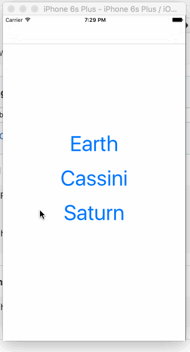

# ScrollView MultiThread Demo

## Summary
Lecture 9 basically talks about using scrollview (so people can scroll around and zoom in/out in a portion or the entirety of a particular view).  In order for for scrollview to actually zoom in and out, you need to set the following:
  * `UIScrollView.minimumZoomScale`
  * `UIScrollView.maximumZoomScale`
  * `UIScrollView.contentSize` -- just how large the content view is.

You also need to set the delegation to yourself in scrollview so you can implement the following:
    `func viewForZoomingInScrollView(scrollView: UIScrollView) -> UIView? {
    `    return imageView
    `}

And you'd need to add a subview (so it actually knows what is embedded inside it):
    `scrollView.addSubview(imageView)`

For images, you'd just use UIImage; you'd set stuff like:
  * `.sizeToFit()`
  * `.image = UIImage(data: some stuff)`
  * UIImage is usually embedded under `UIImageView()`

For multithreading, the syntax to dispatch a non-main thread is as follows:
```swift
let qos = Int(QOS_CLASS_USER_INITIATED.rawValue)
    dispatch_async(dispatch_get_global_queue(qos, 0) {
				//closure of async stuff to do here
				dispatch_async(dispatch_get_main_queue()) { //get back to the main thread
					 //stuff to do in main thread here
				}
     })
```

Basically, you'd just use `dispatch_async` and specify the kind of queue you want and shove the code you want executed in the form of a closure.  If you'd like to get back to the main queue, just explicitly call it from the auxiliary queue.

## Demo

